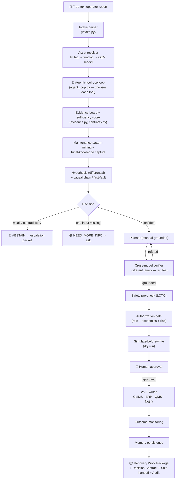

# 🏗️ Restart OS — Architecture

> **Read this first, in plain English:** Restart OS is an agent that helps recover a downed production line. A person types what they see ("filler keeps stopping, bottles backing up"). The agent figures out the real fault, gathers proof from every plant system, writes the repair paperwork, checks it for safety, and hands a human a one-button decision — without ever being able to touch the machines. This page explains how it's built, from the big picture down to the data shapes.

For the *why it's safe* story, see [docs/SAFETY_MODEL.md](docs/SAFETY_MODEL.md). For the *final output*, see [docs/RECOVERY_WORK_PACKAGE.md](docs/RECOVERY_WORK_PACKAGE.md). To *run it*, see [docs/DEMO_GUIDE.md](docs/DEMO_GUIDE.md).

---

## 🧠 The 30-second mental model

Picture three rooms:

- 🟦 **The plant floor (OT)** — machines, PLCs, sensors. Restart OS can **look** through the window but the door is **locked** — it can never reach in and turn a knob.
- 🟩 **The office systems (IT)** — work orders, parts, quality, chat. Restart OS can **write here**, but only after a **human signs off**.
- 🟪 **The agent's brain (the engine)** — reads the floor, reasons, writes the paperwork, and refuses when it isn't sure.

Everything below is just detail on those three rooms and the careful path between them.

---

## A. 🔄 End-to-end agent flow

Here's the whole journey of one incident, start to finish.



Step by step, in words:

1. **Intake** — a messy report becomes a structured incident (line, machine, symptom, alarm, urgency, product, deadline, *and what's missing*).
2. **Asset resolution** — match the words to a real asset by joining the historian tag, the maintenance funcloc, and the OEM model.
3. **Agentic loop** — the agent decides which plant system to check next, one tool at a time, reacting to what it finds (not a fixed script).
4. **Evidence board + sufficiency** — every fact is weighted by trust × confidence × freshness; a 0–100 score says whether there's *enough* to act.
5. **Pattern mining & tribal knowledge** — repeat failures surfaced from CMMS history; informal shift-note know-how captured as *unverified* candidates.
6. **Hypothesis + first-fault** — a ranked differential, then a causal chain that names the *first actionable fault* and filters downstream noise.
7. **Decision** — **ACT**, **NEED_MORE_INFO**, or **ABSTAIN** (see section B).
8. **Plan → verify → safety** — a manual-grounded plan, refuted by a second model, then a LOTO safety pre-check.
9. **Gate → simulate → approve** — routed to the right human role; a dry-run preview of the writes; then the human decides.
10. **Write → monitor → learn** — idempotent IT writes, outcome check, and persistence to memory.
11. **Outputs** — the Recovery Work Package, a Decision Contract, a shift handoff, and a tamper-evident audit trail.

---

## B. ⚖️ The decision model — three answers, not one

Most AI demos only know how to succeed. A real plant agent must also know when to *ask* and when to *refuse*.

| Decision | When it happens | What the human gets |
|---|---|---|
| ✅ **ACT** | Evidence sufficient, verifier passed, safety passed | A complete Recovery Work Package + a one-button approval |
| 🟠 **NEED_MORE_INFO** | One specific missing input would unblock the call (e.g. a line number, an alarm code not in the OEM fault map) | A precise ask — *exactly* what to provide and what it unblocks |
| 🔴 **ABSTAIN** | Evidence weak, contradictory, unsafe, or ungroundable | An escalation packet with the next human step |

This is enforced in `orchestration.py`, and every branch ends in a **Decision Contract** (`contracts.py`) — a plain statement of what's allowed, what's forbidden, and what needs approval. A nice property: if the operator's alarm code doesn't resolve to the OEM fault map, the agent returns **NEED_MORE_INFO** rather than silently acting on a guess.

---

## C. 🔒 Safety architecture

The strongest part of the system. Full detail in [docs/SAFETY_MODEL.md](docs/SAFETY_MODEL.md); here's the shape.

```
        ┌────────────────────────── OT (read-only, locked door) ──────────────────────────┐
        │  PLC · SCADA/HMI · sensors  (L0–L2)     │   Historian · MES   (L3)               │
        └───────────────▲──────────────────────────────────▲────────────────────────────--┘
                        │ READ only                          │ READ only
                        │   (assert_capability raises on any WRITE — security.py)
        ┌───────────────┴──────────────── the engine ───────────────────────────────────--┐
        │  gather → reason → verify (2nd model) → safety pre-check → gate → simulate        │
        └───────────────┬───────────────────────────────────────────────────────────────--┘
                        │ WRITE only after human approval
        ┌───────────────▼──────────────── IT / business (L4) ───────────────────────────--─┐
        │  CMMS work order · ERP parts · QMS QC plan · Slack/Teams notify                   │
        └──────────────────────────────────────────────────────────────────────────────--─┘
```

Five layers, each catching what the last might miss:
1. **OT writes impossible by construction** — `security.py` raises `OTWriteForbidden`; there is no allowed path.
2. **Cross-model verifier** — a different model family tries to *disprove* the plan; unresolved citation → blocked.
3. **Safety pre-check** — LOTO present? plan doesn't skip it? doesn't contradict the manual's safety section?
4. **Authorization gate** — role-matched, e-signature for high risk, threshold scaled by downtime cost.
5. **Three-way decision** — it can refuse or ask. Plus a 3–4 week shadow-mode **calibration window** before it may ever act autonomously.

---

## D. 🎬 Demo architecture

The demo is a real scoring asset, so it's a first-class part of the system — not a slide deck.

- `restartos/demo.py` builds **five deterministic scenes** by running the *real* engine (the offline mock model makes results reproducible).
- `ui/demo.html` renders them as a clean cockpit at `/demo`.
- The CLI (`python -m restartos.cli demo`) writes a `_it_state/demo.json` artifact; the server exposes `/api/scenes`.
- Each scene's payload is genuine run output: run JSON, decision contract, evidence sufficiency, recovery work package, IT actions, and the OT-block proof.

The five scenes prove: **ACT**, **NEED_MORE_INFO**, **ABSTAIN**, **verifier self-correction**, and **OT-write-blocked**. See [docs/DEMO_GUIDE.md](docs/DEMO_GUIDE.md).

---

## E. 📦 The Recovery Work Package — schema

The agent's outcome is a first-class object (`restartos/domain.py` → `WorkPackage`), not a chat reply. Fields:

| Field | Meaning |
|---|---|
| `likely_cause` | Diagnosed cause, ISO 14224 code, confidence, and "what would change my mind" |
| `evidence_trail` | The cited facts behind the diagnosis |
| `safe_checks` | LOTO and safety steps |
| `troubleshooting_path` | The manual-grounded procedure, step by step |
| `work_order_draft` | Asset, cause, risk class, time estimate, assigned tech |
| `parts_request` | Part numbers, on-hand quantity, bin |
| `qc_sampling_plan` | AQL, sample size, what to check post-restart |
| `restart_readiness` | The pre-start checklist |
| `shift_handoff` | The structured next-shift note (section F) |
| `causal_chain` | First-fault isolation result |
| `maintenance_patterns` | Mined repeat-failure signals |
| `knowledge_candidates` | Captured tribal knowledge (unverified) |
| `decision_contract` | The allowed / forbidden / approval contract |
| `economics` | Downtime avoided, paperwork avoided, value, risk-adjusted value |

`WorkPackage.artifacts()` returns the whole thing as cleanly named JSON. Full walkthrough: [docs/RECOVERY_WORK_PACKAGE.md](docs/RECOVERY_WORK_PACKAGE.md).

---

## F. 🔁 Shift-handoff architecture

Getting knowledge to the next shift is a core pain, so the handoff is structured for action (`orchestration.py` → `_build_handoff`):

| Field | What it carries |
|---|---|
| `what_happened` | The incident in one line |
| `what_checked` / `what_not_checked` | Which systems were (and weren't) consulted |
| `monitor_next_shift` | Concrete thresholds to watch ("if flow < 36 L/min, don't restart") |
| `parts_reserved_not_installed` | Parts on the way but not yet fitted |
| `safety_loto` | LOTO status — and that a human must confirm completion |
| `unresolved_risks` | E.g. a recurring fault that cleaning isn't solving |
| `assigned_tech` | Who's on it |
| `first_actionable_fault` | The root fault to focus on |

---

## 🗂️ Module map

```
restartos/
├── intake.py          free-text report → structured Incident
├── orchestration.py   the state machine that runs the whole flow
├── agent_loop.py      agentic tool-use loop (chooses each tool)
├── agents.py          specialist "lenses" + hypothesis & planner
├── tools.py           the typed toolbelt over plant systems
├── evidence.py        the evidence graph (trust × confidence × freshness)
├── causal.py          first-fault isolation + causal chain
├── contracts.py       evidence sufficiency, Decision Contract, Escalation Packet
├── verify.py          cross-model verifier + safety pre-check
├── gate.py            authorization gate (role + economics)
├── security.py        OT/IT boundary (OTWriteForbidden)
├── actions.py         idempotent IT write plane
├── memory.py          incident memory (Postgres)
├── rag.py             semantic manual retrieval (Qdrant + BM25)
├── audit.py           hash-chained audit log
├── demo.py            five deterministic demo scenes
├── server.py          HTTP server + cockpits + metrics
└── cli.py             command-line entry points
```

---

## 🟢 What's real vs. mocked

Honest by design. The *intelligence and governance* are real; the *industrial connectors* are simulated with faithful API shapes and documented swap points.

| Layer | Demo mode | Production path |
|---|---|---|
| Historian | CSV / mock | PI Web API / OPC-UA |
| CMMS | JSON / mock | Maximo / Fiix |
| ERP (parts) | JSON / mock | SAP / Oracle |
| QMS | JSON / mock | ETQ / MasterControl |
| HR roster | CSV / mock | Workday / BambooHR |
| Notifications | local receipt | Slack / Teams |
| Manuals | local corpus + Qdrant | SharePoint / Drive / document vault |
| **Agent loop, evidence graph, verifier, safety boundary, gate, audit, RAG** | **Real** | **Real** |

Going from this MVP to a real plant is `.env` configuration plus the calibration window — not a rewrite.
