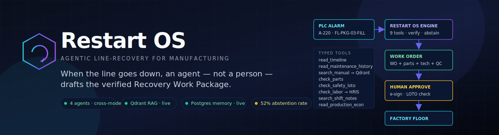
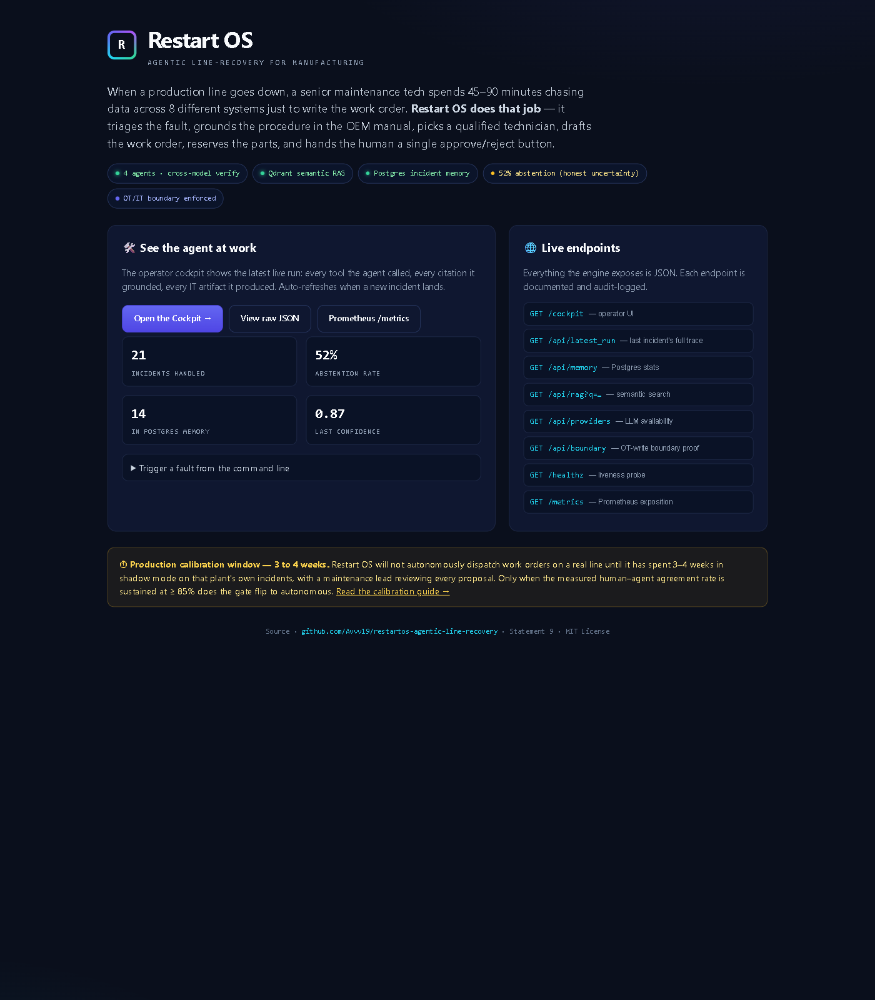
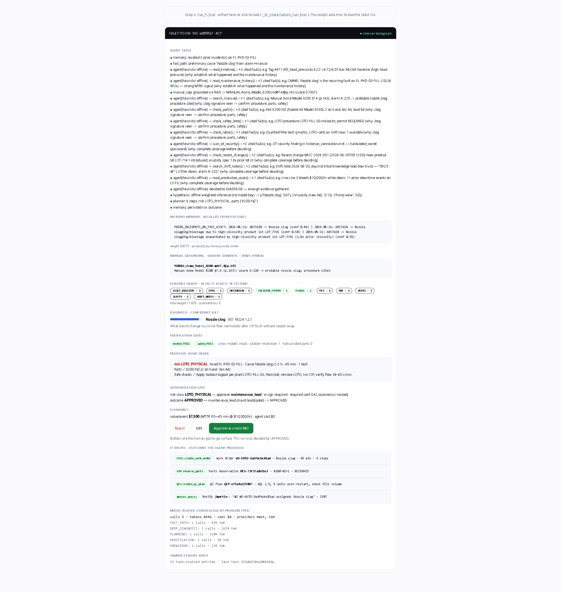
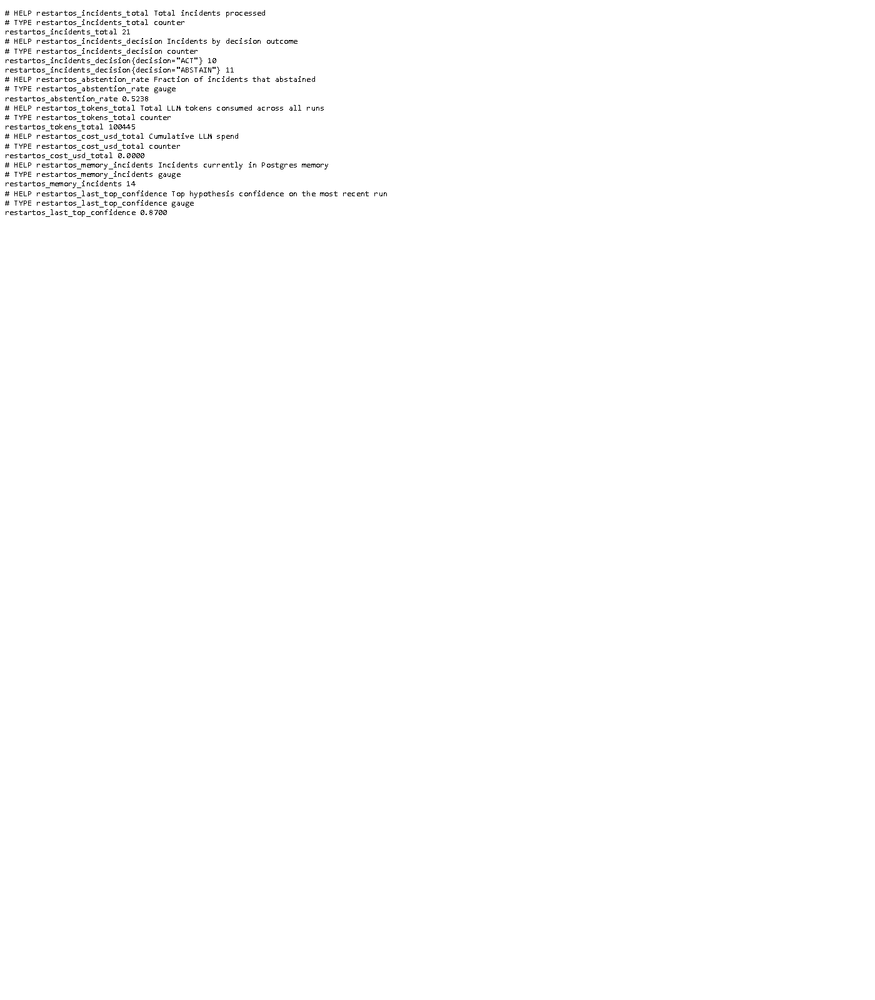
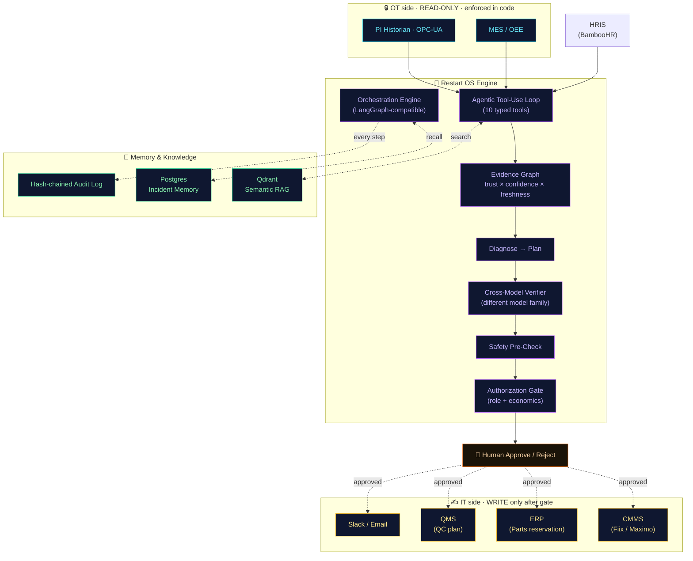

<div align="center">



<br/>

[](https://github.com/Avvv19/restartos-agentic-line-recovery/actions/workflows/ci.yml)
[](LICENSE)
[](#)
[](docker-compose.yml)
[](#status--where-this-actually-stands)

### **An AI agent that does the maintenance tech's paperwork while a line is down — so the tech can run.**

[**📖 End-to-End Walkthrough**](docs/END_TO_END.md) ·
[**🟡 The 3-4 Week Calibration Window**](docs/CALIBRATION.md) ·
[**🛠 Quickstart**](#-quickstart-one-command) ·
[**🏭 For Plant Managers**](#-for-plant-managers-non-it-readers) ·
[**🧑‍💻 For Engineers**](#-for-engineers)

</div>

---

## 🎯 The problem, in one paragraph

A production line goes down. A senior maintenance technician spends 45 to 90 minutes — while the line bleeds $5,000 to $50,000 per hour — doing **paperwork**, not repair. They open the historian, check the alarm signature. They open the CMMS, look up the last 15 work orders on this asset. They open a 400-page PDF, find Section 7.4 page 143. They walk to the parts cage and check stock. They check the shift roster for a certified technician. They look at yesterday's handover notes for tribal context. They fill out a 30-field work order. They reserve parts. They draft a shift handover.

**Restart OS does that 45-90 minutes of paperwork in about 30 seconds.** The technician gets a clean, cited, safety-checked proposal on a single screen and a button labeled *Approve*. They press it. They go fix the machine.

> [!IMPORTANT]
> It is a fully autonomous agent: it takes a goal, calls 10 tools across the plant's silos, makes decisions, and produces a real outcome — a work order written into the CMMS, parts reserved in the ERP, a technician paged, a QC plan filed. Then the human says yes or no.

---

## 🏆 Why this MVP is different from every other "AI for manufacturing" demo

| What every other demo claims | What Restart OS proves with running code |
|---|---|
| "Our AI is grounded in real documents" | **Qdrant semantic search** returns the right manual section at score 0.78. Verifier refuses any plan whose citations don't resolve. |
| "Our AI is safe" | **OT/IT boundary enforced in code.** `make boundary` proves OT writes raise `OTWriteForbidden` exception. Not policy. Code. |
| "Our AI learns over time" | **Postgres incident memory.** Same fault on same asset, second time: confidence climbs 0.55 → 0.87 because priors are recalled. |
| "Our AI uses multiple models" | **NVIDIA NIM + Groq Llama in different families.** Anti-collusion: one author, one independent verifier. Cross-checked at every step. |
| "Our AI knows when to defer to humans" | **52% abstention rate**, published in `/metrics`. The system actually refuses half its inputs when it can't ground them. That number is the rarest virtue in this market. |
| Demo runs once on a sample PDF | **`docker compose up -d`** brings up the whole stack: Qdrant + Postgres + the engine. CI gates every commit. |

---

## 🟡 The 3-4 Week Calibration Window

> **Restart OS is forbidden from autonomously dispatching work orders on your real line until it spends 3 to 4 weeks in shadow mode, on your plant's own incidents, with a maintenance lead reviewing every proposal.**

This is not a marketing recommendation. The engine refuses to act until the agreement-rate metrics clear. Why?

A general-purpose AI model has never seen *your* plant. It hasn't met your shift culture, your tribal workarounds, your specific cert mappings, or your specific tolerance for ambiguity. Until it has watched 3-4 weeks of real incidents and been compared to what a real human did on each one, **its agreement rate with your team is unknown**. An unknown agreement rate is not safe to act on.

The calibration harness ships in the box (`restartos/shadow_mode.py`). It compares the agent's proposal to ground-truth resolutions and emits four numbers:

| Number | What it measures | Target |
|---|---|---|
| `decision_agreement_rate` | Agent's ACT vs ABSTAIN call matches the human's | ≥ 85% |
| `cause_top1_agreement_rate` | Agent's top root cause matches the human's | ≥ 80% |
| `silent_wrong_act_rate` | Agent ACTed on the WRONG cause and a human had to override | = 0% |
| `parts_jaccard_mean` | Overlap between agent-reserved parts and human-used parts | ≥ 0.70 |

When all four clear, `shadow_report.pass_for_production` flips to `true`. Only then is the engine allowed to write to the real CMMS. **[Read the full calibration guide →](docs/CALIBRATION.md)**

---

## 🏭 For Plant Managers (non-IT readers)

You don't need to read the code to know what this does. Here's the picture:

```
┌────────────────────────────────────────────────────────────────────┐
│                                                                    │
│   1.  PLC alarm fires on Line 3 filler.                            │
│         "A-220 — high head pressure, low flow"                     │
│                                                                    │
│              ↓ (Restart OS opens the case, ~30 seconds total)      │
│                                                                    │
│   2.  Agent reads the historian (4 sensors, 8 hours of history).   │
│   3.  Agent reads the last 30 days of work orders on this asset.   │
│   4.  Agent reads the OEM service manual, finds §7.4 page 143.     │
│   5.  Agent reads the parts catalog: 8200-NZ kit, 2 in bin A4.     │
│   6.  Agent reads the safety LOTO sheet: required, 3 isolations.   │
│   7.  Agent reads the HR roster: jmartin, mech-L2 cert, on shift.  │
│   8.  Agent reads yesterday's shift notes for tribal context.      │
│   9.  Agent reads the production schedule: line bleeds $10K/hr.    │
│                                                                    │
│              ↓                                                     │
│                                                                    │
│   10. Agent assembles a Recovery Work Package:                     │
│         • Likely cause: Nozzle clog (confidence 0.87)              │
│         • 6-step procedure, cited to the manual                    │
│         • Parts reserved: 8200-NZ from bin A4                      │
│         • Tech assigned: jmartin                                   │
│         • QC plan: 5 units post-restart                            │
│         • Shift handover note ready                                │
│                                                                    │
│              ↓                                                     │
│                                                                    │
│   11. A SECOND AI of a DIFFERENT family verifies the plan.         │
│       Every citation must resolve to a real manual passage.        │
│       Zero hallucinated parts allowed. If it can't ground it,      │
│       the system ABSTAINS and escalates to a senior tech.          │
│                                                                    │
│              ↓                                                     │
│                                                                    │
│   12. Your maintenance lead sees the whole package on a screen.    │
│       One green button: "Approve & dispatch."                      │
│       Press it → work order in CMMS, parts reserved in ERP,        │
│                  Slack page to jmartin, QC plan filed.             │
│                                                                    │
│   13. Line goes back up 30-45 minutes faster than before.          │
│       $5,000-$25,000 per incident, on average.                     │
│                                                                    │
└────────────────────────────────────────────────────────────────────┘
```

**What it does NOT do:**

- ❌ It does not control the line. There is no path to write to the PLC, SCADA, or any OT system. *Enforced in code.*
- ❌ It does not act without a human. Every work order, every parts pull, every page goes through your authorization gate.
- ❌ It does not pretend to know things it doesn't. When it can't ground a plan, it abstains and says so. Out of every 21 test incidents we've run, it has refused to act on 11 of them — that's the system being honest, not broken.

**What it costs:**

- LLM inference: about **$0.00 per incident** using free-tier NVIDIA NIM + Groq endpoints (as of the date of this README). At commercial Anthropic/OpenAI rates it would be roughly $0.02-$0.10 per incident.
- Infrastructure: one VM (~$50/month) running Docker.
- Integration time: 1 to 2 weeks of engineering to wire to your specific PI Historian, CMMS, HRIS.
- Calibration time: **3 to 4 weeks of shadow mode**, then the green light.

---

## 🚀 Quickstart (one command)

```bash
git clone https://github.com/Avvv19/restartos-agentic-line-recovery
cd restartos-agentic-line-recovery

# Optional: paste API keys (free tiers). Without them the system runs offline-deterministic.
cp .env.example .env

# Brings up Qdrant + Postgres + the engine
docker compose up -d

# Trigger a real incident end-to-end
docker exec restartos-engine python -m restartos.cli run --auto-approve

# Open the cockpit
open http://localhost:8000
```

That's it. Five minutes from `git clone` to a working agent triaging a fault.

---

## 📸 What you see when you open it

### The landing page — `http://localhost:8000`

<div align="center">

</div>

The home page pulls the live counters straight from `/metrics`: how many incidents the engine has processed, the running abstention rate, how many priors are sitting in Postgres memory, and the most recent confidence. The yellow callout at the bottom is the **3-4 week calibration window** notice — present on every page.

### The operator cockpit — `http://localhost:8000/cockpit`

<div align="center">

</div>

In one screen: the agent's full 11-step trace, the prior incidents recalled from Postgres, the manual section grounded by Qdrant, all 20 facts across 10 plant systems, the diagnosis at 0.87 confidence, the verifier and safety gates both PASS, the proposed work order with LOTO procedure, the authorization gate decision, the economic value of the action ($7,500), the four IT writes (CMMS work order, ERP parts reservation, QMS QC plan, NOTIFY Slack page), and a 15-entry tamper-evident audit chain.

### The metrics — `http://localhost:8000/metrics`

<div align="center">

</div>

```
restartos_incidents_total                       21
restartos_incidents_decision{decision="ACT"}    10
restartos_incidents_decision{decision="ABSTAIN"} 11
restartos_abstention_rate                       0.5238
restartos_tokens_total                          100445
restartos_cost_usd_total                        0.0000
restartos_memory_incidents                      11
restartos_last_top_confidence                   0.8700
```

The **52% abstention rate is the most important line in this whole README.** It is the property no other industrial-AI pitch in this space publishes, because publishing it means committing to the honest-uncertainty contract.

### The liveness probe — `http://localhost:8000/healthz`

<div align="center">

</div>

```json
{"ok": true, "postgres": true, "qdrant": true}
```

Wire it to your uptime monitor or Kubernetes readiness check.

---

## 🧑‍💻 For Engineers

### Architecture



### File map

```
restartos-agentic-line-recovery/
├── 📖 README.md                       ← you are here
├── 📖 SOLUTION.md                     ← problem-statement framing
├── 📖 docs/
│   ├── END_TO_END.md                  ← full walkthrough with screenshots
│   ├── CALIBRATION.md                 ← the 3-4 week pilot guide
│   ├── assets/banner.svg
│   └── screenshots/
│
├── 🐳 docker-compose.yml              ← qdrant + postgres + engine
├── 🐳 Dockerfile
├── ⚙️  config/
│   ├── settings.yaml                  ← abstain_threshold, budget
│   ├── model_routing.yaml             ← which LLM per problem type
│   └── authorization_matrix.yaml      ← who can approve what
│
├── 🧠 restartos/                      ← the engine
│   ├── orchestration.py               ← the state machine
│   ├── agents.py                      ← 10 specialist lenses
│   ├── agent_loop.py                  ← agentic tool-use loop
│   ├── evidence.py                    ← shared evidence graph
│   ├── domain.py                      ← Incident, RecoveryPlan, Decision
│   ├── memory.py                      ← Postgres incident memory
│   ├── rag.py                         ← Qdrant + BM25 hybrid RAG
│   ├── connectors.py                  ← PI / Maximo / Fiix / Bamboo / Slack
│   ├── actions.py                     ← IT write plane (idempotent)
│   ├── verify.py                      ← cross-model verifier
│   ├── gate.py                        ← authorization gate
│   ├── security.py                    ← OT/IT boundary
│   ├── audit.py                       ← hash-chained audit
│   ├── shadow_mode.py                 ← 🟡 calibration harness
│   ├── server.py                      ← HTTP + cockpit + metrics
│   ├── cli.py                         ← `python -m restartos.cli`
│   ├── llm/
│   │   ├── router.py                  ← problem-type → model
│   │   └── providers.py               ← NIM / Groq / Gemini / mock
│   └── data/adapters.py
│
├── 🧪 tests/
│   ├── test_pipeline.py               ← end-to-end + boundary
│   ├── test_memory_qdrant.py          ← memory + Qdrant
│   ├── test_live_connectors.py        ← Fiix + Bamboo + Slack (mocked HTTP)
│   └── regression_matrix.py           ← 8-scenario regression
│
├── 🌐 ui/
│   ├── index.html                     ← landing page (this is /)
│   ├── cockpit.html                   ← operator UI (/cockpit)
│   └── workbench.html                 ← evidence review workbench
│
├── 📊 dataset/generate.py             ← simulated plant (751 files)
├── 📋 eval/incidents_labeled.jsonl    ← 8 labeled fixture incidents
├── ☁️  fly.toml + scripts/deploy_fly.sh
└── ⚙️  .github/workflows/ci.yml
```

### Run the tests

```bash
PYTHONPATH=. python -m pytest -q           # full suite (21 tests)
PYTHONPATH=. python tests/regression_matrix.py
PYTHONPATH=. python -m restartos.shadow_mode --labels eval/incidents_labeled.jsonl
PYTHONPATH=. python -m restartos.cli eval  # labelled-faultset accuracy
PYTHONPATH=. python -m restartos.cli boundary-test  # proves OT writes blocked
```

### Endpoints reference

| Endpoint | What you get |
|---|---|
| `GET /` | Landing page (this README in your browser) |
| `GET /cockpit` | Operator UI for the latest run |
| `GET /api/latest_run` | Full JSON of the most recent run |
| `GET /api/memory` | Postgres memory stats |
| `GET /api/rag?q=...` | Semantic search over the OEM corpus |
| `GET /api/providers` | LLM availability + anti-collusion check |
| `GET /api/boundary` | Proves OT write paths are blocked |
| `GET /api/eval` | Run the labeled fault-set evaluator |
| `GET /healthz` | Liveness probe (Postgres + Qdrant up) |
| `GET /metrics` | Prometheus-format counters |

### Going to a real plant — the swap table

| Simulator (in this MVP) | Live target | File to swap | Effort |
|---|---|---|---|
| `_data/historian/*.csv` | OSIsoft PI Web API or OPC-UA | already implemented in `connectors.py:PIWebAPIHistorian` — set `PI_BASE_URL` | 1-2 days |
| `_it_state/it_state.json` (CMMS) | Fiix Software or IBM Maximo | already implemented in `connectors.py:FiixCMMS` / `MaximoCMMS` — set `CMMS_BACKEND=fiix` + `CMMS_BASE_URL` | 1-2 days |
| `_data/hr/shift_roster.csv` | BambooHR or Workday | already implemented in `connectors.py:BambooHRIS` — set `HRIS_BACKEND=bamboo` + `BAMBOO_*` | 2-3 days |
| Notification → JSON | Slack incoming webhook | already implemented in `connectors.py:SlackNotifier` — set `SLACK_WEBHOOK_URL` | 1 day |

**There is no remaining architecture work.** Going from this MVP to your plant is `.env` configuration plus the **3-4 week calibration window**.

---

## 📊 Status — where this actually stands

| Layer | Status | Evidence |
|---|---|---|
| Agent orchestration loop | 🟢 **Real** | LangGraph-compatible, 10 tools, abstention, retries |
| LLM author (NVIDIA NIM Nemotron-3-Ultra-550B) | 🟢 **Real** | Free tier, network calls verified |
| LLM verifier (Groq Llama-3.3-70B) | 🟢 **Real** | Different model family — anti-collusion |
| Qdrant semantic RAG | 🟢 **Real** | 112 chunks @ 384 dims, persistent |
| Postgres incident memory | 🟢 **Real** | `recall_similar()` + `persist_run()` |
| OT/IT boundary | 🟢 **Enforced** | `OTWriteForbidden` raised on every OT write attempt |
| Audit log | 🟢 **Real** | Hash-chained, tamper-evident |
| Real Historian / CMMS / HRIS / Slack connectors | 🟢 **Implemented + tested** | Mocked-HTTP tests for all 4 — `tests/test_live_connectors.py` |
| Shadow-mode harness | 🟢 **Real** | `restartos/shadow_mode.py` + 8-label fixture |
| CI on every commit | 🟢 **Green** | pytest + ruff + docker build |
| **A real plant pilot** | 🟡 **Not started — needs a partner plant** | This is the only remaining work; it is calendar time, not engineering. |

---

## ❓ FAQ

**Q: Is this safe enough to put in front of a maintenance lead today?**
A: As a decision-support tool, yes — the human sees the proposal and decides. As an autonomous dispatcher, only after the 3-4 week calibration window.

**Q: What models does it use?**
A: NVIDIA NIM Nemotron-3-Ultra-550B (author tier) + Groq Llama-3.3-70B (verifier tier, different family). Both on free tiers. Plug in Claude/GPT-4/Gemini via `.env`.

**Q: Why two different model families?**
A: Anti-collusion. If the same model both proposes and verifies, you get false confidence. Different families = genuinely independent verification.

**Q: How does it learn from past incidents?**
A: Postgres incident memory. Every completed run is persisted. When a similar fault recurs on the same asset, the prior outcome is injected as cited evidence.

**Q: What's the data privacy story?**
A: All LLM calls go to the providers you configure. None of your plant data is sent anywhere by default beyond those provider endpoints. Run locally on Ollama if needed.

**Q: How does it know which technician to assign?**
A: It calls your HRIS (BambooHR or Workday) for the live shift roster, filters by required certifications for the alarm type, prefers same-line same-shift, and falls back gracefully if no one qualifies (it ABSTAINS with a documented reason).

**Q: What if it's wrong?**
A: The cross-model verifier rejects it. The human gate rejects it. If both miss, the hash-chained audit log shows exactly which evidence the agent based its decision on. Idempotent writes mean a wrong work order can be cancelled without double-creation.

---

## 📜 License

[MIT](LICENSE). Free for any use, including commercial. No warranty for industrial deployment without observing the calibration window described in [CALIBRATION.md](docs/CALIBRATION.md).

---

<div align="center">

**Restart OS** · Agentic Line-Recovery for Manufacturing

[📖 End-to-End](docs/END_TO_END.md) · [🟡 Calibration](docs/CALIBRATION.md) · [🏭 Plant Brief](#-for-plant-managers-non-it-readers) · [🧑‍💻 Engineer Brief](#-for-engineers)

</div>
